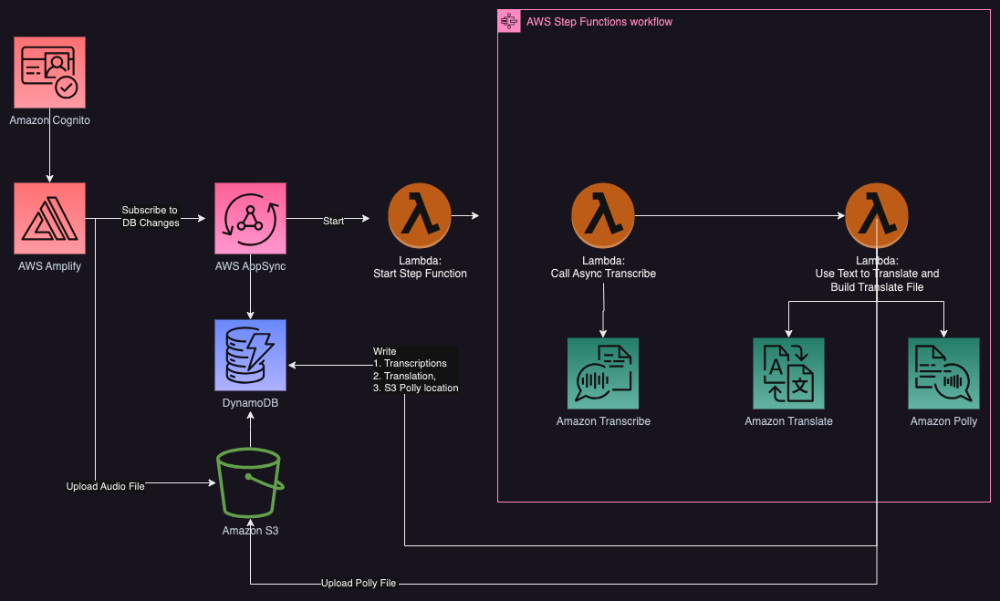

# Getting started

- There are two sides of this project
- The backend is entirely in CDK and Typescript
- The frontend is entirely in Amplify React and Typescript 
    - The fe_voice_translator folder holds all of the frontend work

- Please copy the ``.env.example`` file to create a new ``.env`` file, and update it according to your configuration.

## Architecture 



### Getting started command
#### Backend 
  - ``yarn install``
  - ``yarn build``
  - ``yarn synth; yarn deploy``

- If profile is different:
```bash
projen deploy --all --profile <your profile> --region <your region>
````

#### Frontend
- You will need to **initialize** your own Amplify project in your AWS account.
- Navigate to the frontend directory:
  ```bash
  cd <your-frontend-directory>
  ```

- If the Amplify project already exists, run
  ```bash
  amplify pull
  ```

- If the Amplify project doesn't exist, run
  ```bash
  amplify init
  ```
- To connect Amplify with CDK, run the following commands:
```bash
amplify import auth
amplify import storage
  ```

- Please copy the ``.env.example`` file to create a new ``.env`` file, and update it according to your configuration.

- Start the frontend:
  ```npm run start```


## Security

See [CONTRIBUTING](CONTRIBUTING.md#security-issue-notifications) for more information.

## License

This library is licensed under the MIT-0 License. See the LICENSE file.
